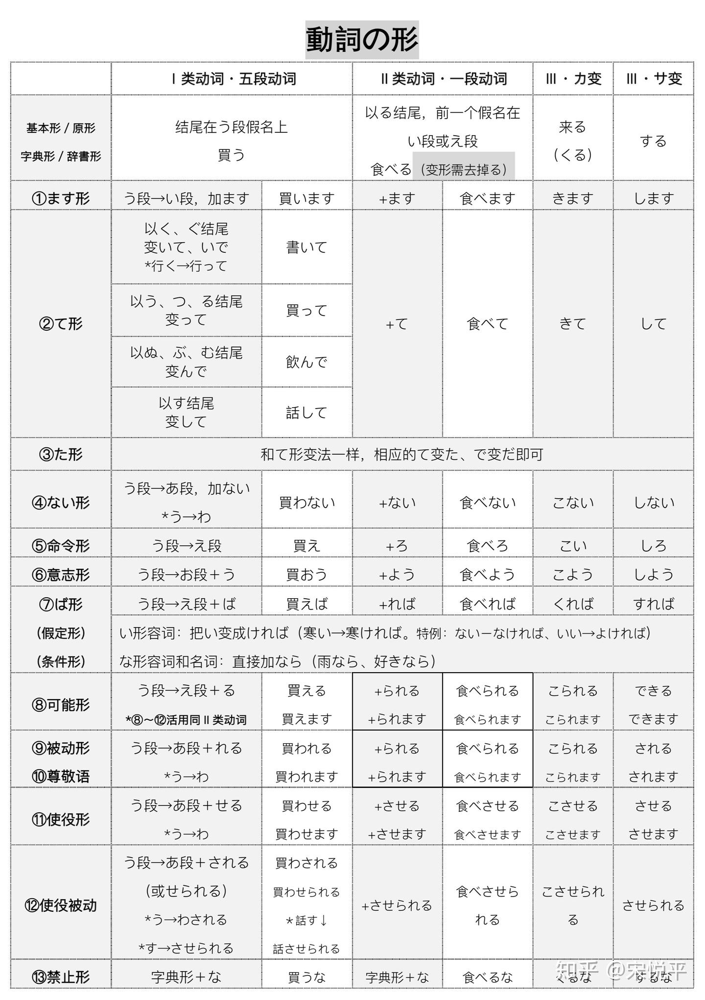
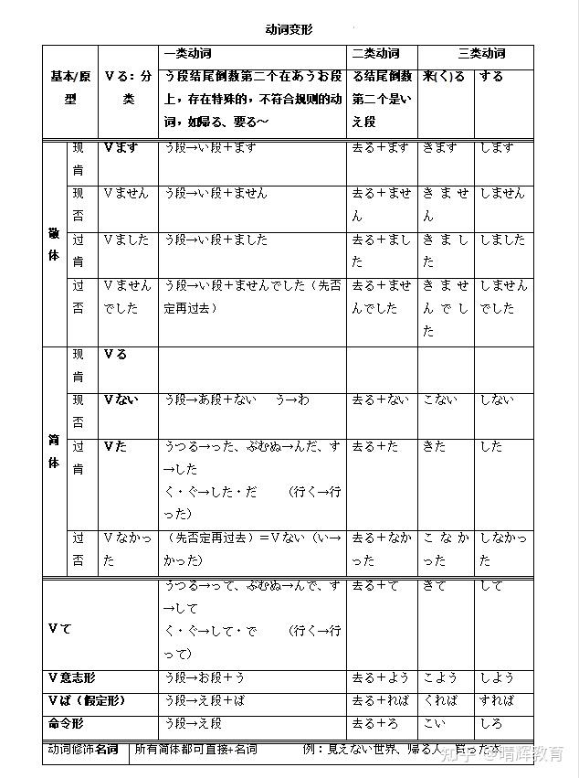

# 动词活用

### 动词分类

**五段动词(一类动词)**

う段结尾的动词

**一段动词(二类动词)**

る结尾且倒数第二个在い/え段的动词 (少数即使符合规则 但是是五段动词)&#x20;

上一段动词: いる结尾的动词 \
下一段动词: える结尾的动词

**サ变动词(三类动词)**

主要动词：する(做)   和名词结合可以构成(する动词)

**カ变动词(三类动词)**

只有一个动词：来る(くる，来)

### 学校语法七形

将动词根据动词分类做变化 再加上不同的词缀表不同的意义(时态、否定、被动等)

* **未然形**

表示"尚未发生"的状态 \
接续: 否定、被动、使役、意向

_后缀规律_： \
五段动词：う段 → あ段 （动词结尾是「う」时，变为「わ」） \
一段动词：去掉る 即词干 \
サ变：する → し \
カ变：来る（くる） → こ

* **连用形**

用于连接其他用言、接助动词，或变成名词性 \
接续: ます、て、た等

_后缀规律_： \
五段动词：う段 → い段 \
一段动词：去掉る 即词干 \
サ变：する → し \
カ变：来る（くる） → き

另: 在 て形・た形 等连用形接续中，会发生 音便

* **连体形**

修饰名词 \
接续: \
后缀规律：为基本形

* **终止形**

句子结尾 \
接续: \
&#xNAN;_&#x540E;缀规律_：为基本形

* **命令形**

表示命令 接续:

_后缀规律_： \
五段动词：う段 → え段 \
一段动词：去掉る + ろ(口语) 或 よ(书面) \
サ变：する → しろ／せよ \
カ变：来る（くる） → 来い（こい）

* **假定形**

_后缀规律_： \
五段动词：う段 → え段 + ば \
一段动词：词干 + れば \
サ变：する → すれば \
カ变：来る → 来れば

* **意志形**

表示意志 接续:

_后缀规律_： \
五段动词：う段 → お段 + う \
一段动词：去掉る + よう \
サ变：する → しよう \
カ变：来る（くる） → 来よう（こよう）

### 动词形态变形

* **基本形（辞书形）**\
  动词的原始形 / 词典收录形\
  原形 / 基本形 / 普通形 / 辞书形 都是同一种 即动词的原形
* **ない形（否定形）**\
  表否定\
  后缀规律：\
  五段动词：う段 → あ段 + ない 例外: ある → ない\
  一段动词：词干 + ない\
  サ变：する → しない\
  カ变：来る（くる） → 来ない（こない）
* **被动形/受身形**\
  表示被动、受害、受影响。\
  后缀规律：\
  五段动词：う段 → あ段 + れる\
  一段动词：词干 + られる\
  サ变：する → される\
  カ变：来る（くる） → 来られる（こられる）
* **使役形**\
  表示使役（让/迫使别人做）\
  后缀规律：\
  五段动词：う段 → あ段 + せる\
  一段动词：词干 + させる\
  サ变：する → させる\
  カ变：来る（くる） → 来させる（こさせる）
* **使役被动形**\
  被迫做/被使役 而使役形为迫使他人做\
  后缀规律：\
  五段动词(口语)：う段 → あ段 + される\
  五段动词(书面)：う段 → あ段 + せられる\
  一段动词：词干 + させられる\
  サ变：する → させられる\
  カ变：来る（くる） → 来させられる（こさせられる）
* **否定意志形**\
  表示坚决不做某事\
  书面后缀规律： 基本形 + まい\
  口语后缀规律： 变为ない形 + でおこう
* **ます形（敬体形）**\
  表示礼貌、敬体。\
  后缀规律：\
  五段动词：う段 → い段\
  一段动词：词干 + ます\
  サ变：する → します\
  カ变：来る（くる） → 来ます（きます）
* **て形**\
  持续(〜ている)、结果状态(〜てある)、\
  尝试(〜てみる)、完成(〜てしまう)、许可(〜てもいい)、\
  禁止(〜てはいけない)、请求(〜てください)等多功能\
  后缀规律：\
  五段动词：\
  う、つ、る → って\
  ぶ、む、ぬ → んで\
  く → いて\
  ぐ → いで\
  す → して\
  例外: 行く → 行って（唯一特殊的「く」动词）\
  一段动词：词干 + て\
  サ变：する → して\
  カ变：来る（くる） → 来て（きて）
* **た形**\
  表动作已经完成/确定 而て形表未完成 表示过去、完成、\
  经验(〜たことがある)、假定(〜たら)\
  后缀规律：\
  五段动词：\
  う、つ、る → った\
  ぶ、む、ぬ → んだ\
  く → いた\
  ぐ → いだ\
  す → した\
  例外: 行く → 行った（唯一特殊的「く」动词）\
  一段动词：词干 + た\
  サ变：する → した\
  カ变：来る（くる） → 来た（きた）
* **命令形**\
  表示命令、强制\
  后缀规律：\
  五段动词：う段 → え段\
  一段动词：词干 + ろ\
  サ变：する → しろ／せよ\
  カ变：来る（くる） → 来い（こい）
* **ば形（假定形）**\
  表示假定条件\
  〜ば／たら → 如果（假设）\
  〜と → 一……就……（必然规律）\
  〜なら → 如果是……（前提、对方说的）\
  后缀规律：\
  五段动词：う段 → え段 + ば\
  一段动词：词干 + れば\
  サ变：する → すれば\
  カ变：来る（くる） → 来れば（くれば）
* **可能形**\
  表能力 / 可能性\
  后缀规律：\
  五段动词：う段 → え段 + る\
  一段动词：词干 + られる\
  サ变：する → できる\
  カ变：来る（くる） → 来られる（こられる）
* **意志形/意向形**\
  表示意志、推量、邀请\
  后缀规律：\
  五段动词：う段 → おう\
  一段动词：词干 + よう\
  サ变：する → しよう\
  カ变：来る（くる） → 来よう（こよう）

| 活用形           | 功能                 | 常见衍生形态 / 用法                                | 后缀规律                                                  |
| ------------- | ------------------ | ------------------------------------------ | ----------------------------------------------------- |
| **未然形**       | 未发生、否定、假定、可能、被动、使役 | ない形（否定）、可能形、被动形、使役形、使役被动形、否定意志形（まい/ないでおこう） | +ない、+れる、+せる、+まい、+う（部分推量/意志）                           |
| **连用形**       | 动作连接、构造敬体、时态变化     | ます形（敬体）、て形、た形、ます/ました、ている、てある、てみる           | +ます、+て、+た、+いる、+ある                                     |
| **终止形**       | 句子结尾，断定            | 基本形（辞书形，普通体句尾）                             | —                                                     |
| **连体形**       | 修饰体言（名词）、连接助词      | 基本形（辞书形修饰）、〜とき、〜こと                         | —                                                     |
| **已然形 / 假定形** | 表示假定、条件            | ば形（假定形）                                    | +ば                                                    |
| **命令形**       | 表命令、强制             | 命令形                                        | 
五段：う段→え段 一段：词干+ろ サ变：する→しろ/せよ カ变：来る→来い
 |

| 形态            | 意义                                                    | 后缀规律                                                                 |
| ------------- | ----------------------------------------------------- | -------------------------------------------------------------------- |
| **基本形（辞书形）**  | 动词原始形 / 词典收录形                                         | —                                                                    |
| **ない形（否定形）**  | 表否定                                                   | 未然形 + ない                                                             |
| **ます形（敬体形）**  | 表礼貌、敬体                                                | 连用形 + ます                                                             |
| **て形**        | 表动作未完成；顺接、并列、持续、结果、尝试、完成、许可、禁止、请求等                    | 连用形 + て（含音便规则）                                                       |
| **た形**        | 表过去、完成、经验、假定                                          | 连用形 + た（含音便规则）                                                       |
| **命令形**       | 表命令、强制                                                | 
五段：う段→え段； 一段：词干+ろ； サ变：する→しろ／せよ； カ变：来る→来い
             |
| **意志形 / 意向形** | 表意志、推量、邀请                                             | 
五段：う段→おう； 一段：词干+よう； サ变：する→しよう； カ变：来る→来よう
             |
| **ば形（假定形）**   | 
假设条件（如果……）； 〜ば／たら（假设）、〜と（一……就……）、〜なら（如果是……）
 | 
五段：う段→え段+ば； 一段：词干+れば； サ变：する→すれば； カ变：来る→来れば
           |
| **可能形**       | 表能力 / 可能性                                             | 
五段：う段→え段+る； 一段：词干+られる； サ变：する→できる； カ变：来る→来られる
         |
| **被动形 / 受身形** | 表被动、受害、受影响                                            | 
五段：う段→あ段+れる； 一段：词干+られる； サ变：する→される； カ变：来る→来られる
        |
| **使役形**       | 表使役（让/迫使别人做）                                          | 
五段：う段→あ段+せる； 一段：词干+させる； サ变：する→させる； カ变：来る→来させる
        |
| **使役被动形**     | 表被迫做（被使役）                                             | 
五段：う段→あ段+される； 一段：词干+させられる； サ变：する→させられる； カ变：来る→来させられる
 |
| **否定意志形**     | 表坚决不做某事                                               | 
书面：基本形+まい； 口语：未然形+ないでおこう
                                   |

### 动词的时态

| 时态     | 肯定 | 否定    | 说明         |
| ------ | -- | ----- | ---------- |
| 现在/非过去 | V  | Vない   | 表示现在或习惯性动作 |
| 过去     | Vた | Vなかった | 表示过去发生的动作  |

### 动词的敬体

| 时态     | 肯定   | 否定      | 说明           |
| ------ | ---- | ------- | ------------ |
| 现在/非过去 | Vます  | Vません    | 敬体形式，适用于礼貌场合 |
| 过去     | Vました | Vませんでした | 敬体过去形        |

### 动词修饰名词

作用: 日语名词本身没有时态、数、格的变化, 动词可以放在名词前，形成一个 **定语短语**，说明名词的状态或性质\
通过动词的 **不同形态**（原形 / た形 / ている形）可以表达：\
1 动作是否完成 → た形（例：書いた本 = 写好的书）\
2 动作持续中 → ている形（例：勉強している学生 = 正在学习的学生）\
3 将来 / 意图 → 原形（例：読む本 = 要读的书）

| 日文     | 动词形态 | 中文意思  |
| ------ | ---- | ----- |
| 読む本    | 原形   | 要读的书  |
| 読んだ本   | た形   | 读过的书  |
| 読んでいる本 | ている形 | 正在读的书 |
| 勉強する学生 | 原形   | 学习的学生 |
| 勉強した学生 | た形   | 学过的学生 |

<figure><figcaption></figcaption></figure>

<figure><figcaption></figcaption></figure>

