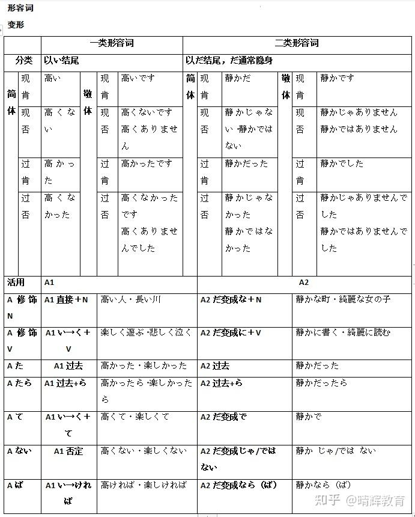

# 形容词活用

### 形容词分类

日语中的形容词可以做谓语 因为形容词可以有时态、否定的活用变化

**イ形容詞（い形容词）**

结尾特征：以「い」结尾（但注意有些例外，如「きれい」不是い形容词）。 活用：可以直接变化。 \
功能：既能修饰名词，也能谓语。

**ナ形容詞（な形容词/形容动词）**

结尾特征：无特定结尾  \
功能：修饰名词时要加「な」，作谓语时要加「だ／です」。

### 形容词活用

| 活用类别      | イ形容詞      | ナ形容詞      |
| --------- | --------- | --------- |
| 基本形       | 【A】い      | 【B】だ      |
| 否定形       | 【A】くない    | 【B】ではない   |
| 过去形       | 【A】かった    | 【B】だった    |
| 否定过去      | 【A】くなかった  | 【B】ではなかった |
| 连用形(副词化)  | 【A】く      | 【B】に      |
| 连体形(修饰名词) | 【A】い + 名词 | 【B】な + 名词 |
| 假定形       | 【A】ければ    | 【B】なら     |
| 推量形       | 【A】かろう    | 【B】だろう    |

### 形容词敬体

| 形容词 | 肯定  | 否定      | 过去   | 过去否定      |
| --- | --- | ------- | ---- | --------- |
| 形容词 | Aです | Aじゃないです | Aでした | Aじゃなかったです |

<figure><figcaption></figcaption></figure>
